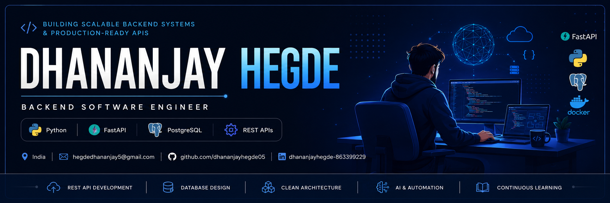

<p align="center">
  
</p>

<h1 align="center">Hi 👋, I'm Dhananjay Hegde</h1>

<h3 align="center">
Backend Software Engineer • Python • FastAPI • PostgreSQL • REST APIs
</h3>

<p align="center">

[](https://git.io/typing-svg)

</p>

<p align="center">


</p>

---

## 👨‍💻 About Me

🚀 Backend Software Engineer from India 🇮🇳

🔭 Currently building **Role-Based Ecommerce API**

🌱 Learning **Docker, AWS, Kubernetes, Redis & System Design**

💡 Passionate about building scalable backend systems and production-ready REST APIs.

📫 Reach me at **hegdedhananjay5@gmail.com**

🚀 Open to Backend Software Engineer opportunities.

🌐 Portfolio: https://your-portfolio-link.vercel.app
---

# 🚀 Featured Projects

| Project | Stack | Highlights |
|----------|-------|------------|
| 🚀 **Role-Based Ecommerce API** | FastAPI • PostgreSQL • JWT | Secure authentication, RBAC, modular architecture |
| 📋 **TaskFlow API** | FastAPI • PostgreSQL | Task management with JWT authentication |
| 🤖 **HireSense AI** | Python • FastAPI | ATS Resume Analyzer using AI |
| 👤 **FaceFocus Pro** | OpenCV • DeepFace | AI Employee Monitoring System |
| 🌐 **Portfolio** | React • Tailwind CSS | Responsive developer portfolio |

---

# ⚒ Tech Stack

## Backend

<p align="center">

</p>

## Languages

<p align="center">

</p>

## Databases

<p align="center">

</p>

## Tools

<p align="center">

</p>

---

# 🏆 Achievements

- ✅ Built multiple production-ready REST APIs
- ✅ JWT Authentication
- ✅ PostgreSQL & SQLAlchemy
- ✅ AI-powered applications
- ✅ Backend-first architecture
- ✅ Clean Code & Modular Design

---

## 📊 GitHub Stats

<p align="center">
  
  
</p>

---

# 📈 Contribution Activity

<p align="center">

</p>

---

# 🏆 Trophy Cabinet

<p align="center">

</p>

---

# 📚 Currently Learning

```text
🐳 Docker
☁️ AWS
☸ Kubernetes
⚡ Redis
🔄 GitHub Actions
🏗 System Design
```

---

# 📫 Let's Connect

<p align="center">

<a href="mailto:hegdedhananjay5@gmail.com">

</a>

<a href="https://www.linkedin.com/in/dhananjayhegde-863399229">

</a>

<a href="https://leetcode.com/u/dhananjayhegde">

</a>

<a href="https://www.instagram.com/dhananjay__hegde">

</a>

</p>

---

# 💭 Quote

<div align="center">

> *"Great software isn't just functional—it's maintainable, scalable, and thoughtfully engineered."*

</div>

---

## 🐍 Contribution Snake

<p align="center">
  
</p>

---

<div align="center">

### ⭐ Thanks for visiting my profile!

If you like my work, consider giving a ⭐ to my repositories.

</div>
